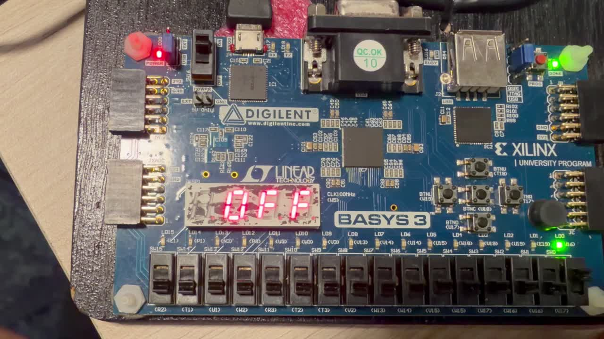
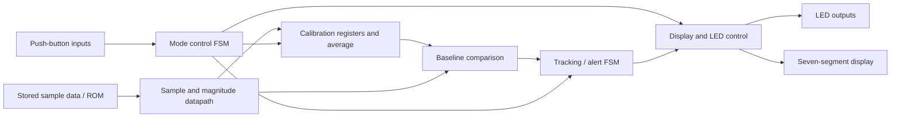
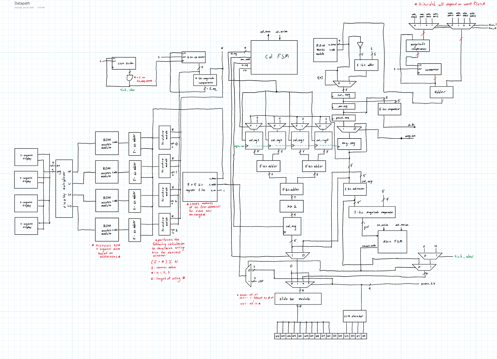

# FPGA Earthquake Detection System

A Digilent Basys 3 project that combines stored sample data, calibration, finite state machines, and a digital datapath to indicate a seismic event through LEDs and a seven-segment display.

**Focus:** FPGA logic · Datapath and control design · FSMs · ROM data · Hardware interfaces

[](media/fpga-demo.mp4)

*Frame at 00:05 from the [FPGA demonstration](media/fpga-demo.mp4), showing the Basys 3 board with “OFF” on its seven-segment display.*

## Overview

This project implements an earthquake detection demonstrator on a Basys 3 FPGA board. It uses stored sample data, a calibration baseline, and detection logic, with push-button controls and visual status outputs. The project brings together arithmetic, sequential control, ROM access, and user-interface logic in one hardware system.

The available materials document the architecture and include a board demonstration. HDL, constraints, ROM initialization files, and verification reports still need to be added before the implementation can be reproduced.

## System Architecture



This is a functional summary of the supplied design drawings. The [full datapath drawing](hardware/datapath.pdf) contains the register, arithmetic, ROM, and display connections; [architecture notes](docs/architecture.md) explain what the drawings establish and what still requires confirmation.

## Modes of Operation

| State in the HLSM | Role documented by the diagrams |
| --- | --- |
| Off (`00`) | Initial state; control input selects calibration or tracking. |
| Calibration (`01`) | A separate controller loads four calibration registers, then loads an average register. |
| Tracking (`10`) | A tracking controller monitors the threshold indication and controls the alert output mode. |
| Acknowledge (`11`) | Provides the acknowledgement input used to clear the tracking controller's latched alert. |

**TODO — confirm final mode names:** the project brief uses “Read / Detect” and “Pause,” while the HLSM labels the corresponding operating states “Tracking” and “Acknowledge.” Their exact relationship must be checked against the final HDL and button behavior.

## Datapath

The design drawing shows:

- A ROM sample source, waveform-selection multiplexers, and address-generation logic.
- Current and previous sample registers, a comparator, a magnitude register, and a small engine FSM that generates `mag_en`.
- Four calibration registers whose values are added and shifted right by two before being stored as a baseline average.
- Subtraction of the calibration baseline from a stored magnitude, followed by a comparator with an output labeled `gt5`.
- ROM-based display data, character-window logic, a display multiplexer, an LED bar module, and a state decoder.



**TODO — reconcile arithmetic widths:** the project brief describes a 16-bit datapath; the drawing labels many sample registers and arithmetic blocks as 5-bit, with wider intermediate sums. The final HDL is needed to establish the implemented widths, signedness, overflow handling, and relationship to the 16-LED output.

## Control FSMs

| Diagram | Responsibility |
| --- | --- |
| [High-level state machine](images/architecture/hlsm.png) | Coordinates the operating modes. |
| [Calibration FSM](images/architecture/calibration-fsm.png) | Sequences the four calibration-register loads and the average-register load. |
| [Engine FSM](images/architecture/engine-fsm.png) | Uses comparator input `p_lt` to generate a magnitude-register enable on a state transition. |
| [Tracking FSM](images/architecture/tracking-fsm.png) | Enters an alert state when `gt5` is asserted and holds that state until acknowledgement. |

## Inputs / Outputs

| Interface | Purpose |
| --- | --- |
| Push buttons | User control of the operating modes. Exact mapping is TODO. |
| Switches | The datapath drawing uses `sw_1` and `sw_0` to select stored-waveform parameters. Confirm the implemented mapping. |
| Stored sample data | Supplies the input sequence used by the detector. Sample provenance, units, and ROM contents are TODO. |
| LEDs | Show state and datapath/alert information. Confirm the final LED mapping. |
| Seven-segment display | Displays information through ROM access, window logic, and multiplexing. Confirm the message strings and update rate. |

## My Contribution

Implemented the FPGA earthquake detection system on a Digilent Basys 3 board using a datapath and control logic.

**TODO:** identify which HDL modules, state machines, datapath blocks, board integration, and verification tasks I personally completed; include collaborators and attribution if this was a team project. Confirm the HDL language before adding Verilog to the technology list.

## Verification, Debugging & Results

The repository includes architecture drawings and a board demonstration. Numerical detector performance and FPGA implementation metrics remain to be documented.

See the [verification plan and evidence checklist](docs/verification.md) for the remaining documentation:

- TODO: add HDL, testbenches, simulation waveforms, and expected-versus-observed results.
- TODO: document an actual debugging example, including the symptom, cause, fix, and verification.
- TODO: record the implemented clock, sample update rate, detection latency, utilization, and timing results if measured.
- TODO: document threshold units, the evaluation data, and false-positive/false-negative behavior if evaluated.

## Media

- [High-level state machine](images/architecture/hlsm.png)
- [Calibration controller](images/architecture/calibration-fsm.png)
- [Magnitude engine controller](images/architecture/engine-fsm.png)
- [Tracking / alert controller](images/architecture/tracking-fsm.png)
- [Full datapath PDF](hardware/datapath.pdf)
- [FPGA demonstration video](media/fpga-demo.mp4)
- [Board preview at 00:05](images/fpga-demo.jpg)

## Repository Structure

```text
README.md
docs/
  architecture.md          # Diagram interpretation and open implementation questions
  verification.md          # Evidence to add and proposed test cases
hardware/
  datapath.pdf             # Original design drawing
images/
  architecture/            # FSM images and readable datapath preview
  fpga-demo.jpg            # Frame at 00:05 from the board demonstration
media/
  fpga-demo.mp4            # Board demonstration video
```

Add `src/`, `sim/`, and `constraints/` when the actual HDL, testbenches, and board constraints are available. Preserve their original organization if the source project already has one.

## Reproducing the Project

Reproduction is pending the source files. The hardware platform is Digilent Basys 3. TODO: add the FPGA toolchain and version, top-level module, source and ROM file list, board constraints, simulation commands, programming steps, and expected button/display behavior.

## Next Steps

- Publish the HDL and stored sample data with provenance and any required attribution.
- Resolve mode-name and datapath-width differences between the brief and drawings.
- Add a concise demonstration walkthrough with inputs and expected outputs.
- Document functional verification before making quantitative performance claims.
