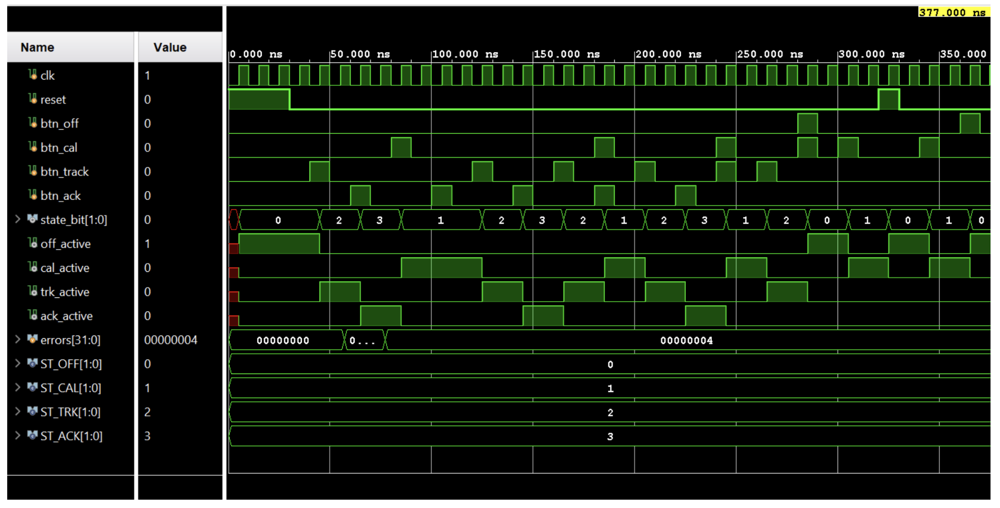
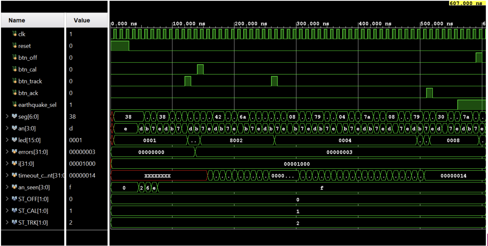
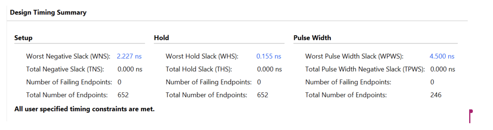
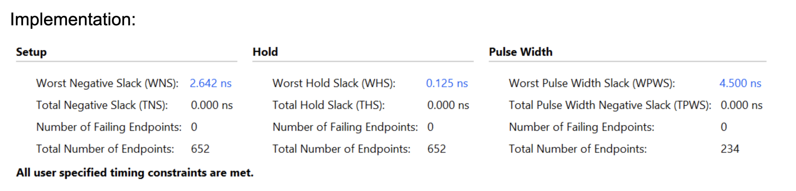

# Verification, Debugging & Results

The Lab 4b implementation deliverable documents controller and integration simulations, a five-scenario results table, Vivado timing and utilization summaries, and the design changes made during implementation. This page summarizes that evidence and preserves the unresolved difference between the reported results and the waveform error counters.

**Source:** *Tokyo Earthquake Early Warning Monitor - ECE 316, Summer 2026, Lab 4b Implementation Phase Deliverables*, by JP and Inu Baek. Page references below refer to the supplied 10-page lab deliverable. The waveform and timing figures are extracted directly from that document.

## Simulation Evidence

The deliverable names `controller_tb.sv` for controller testing and `eew_top_tb.sv` for integration testing. It also records the use of AI assistance to generate the testbenches after supplying project files for context (p. 1). The testbench source and simulator logs are not yet included in this repository.

### Controller Unit Test

The controller waveform exercises reset, the `btn_off`, `btn_cal`, `btn_track`, and `btn_ack` inputs, the two-bit state, and the four mode-active outputs (p. 2). Its constants identify Off = 0, Calibration = 1, Tracking = 2, and Acknowledge = 3.

At the screenshot's displayed time of **377.000 ns**, the value column shows **`errors[31:0] = 00000004`**. The screenshot demonstrates that the controller was simulated; it does not establish a clean unit-test result.

### Integration Scenarios

The lab's scenario table reports the following five checks as **Pass** (p. 3). The behaviors below summarize that table's expected-result column; they have not been independently rerun from source.

| Scenario | Behavior recorded in the lab table | Reported result |
| --- | --- | --- |
| Reset | `LD3:0 = 0001`; display shows `OFF`. | Pass |
| Calibration | Capture four samples, show `DONE`, and latch the baseline. | Pass |
| Measuring / tracking | Scroll `READING`; `LD15:6` bar reflects `reading - baseline`. | Pass |
| Threshold crossing | When `reading - baseline > 5`, set the alert latch, show `ALERT`, and flash the bar LEDs; keep the latch set when the value falls below 5. | Pass |
| Acknowledge and return to Off | Clear the latch/value, scroll `ACKNOWLEDGED`, and return to Off with `LD3:0 = 0001`. | Pass |

At the screenshot's displayed time of **607.000 ns**, the value column shows **`errors[31:0] = 00000003`**. This nonzero counter is unresolved and prevents treating the table's five Pass entries as a confirmed clean regression. The available document does not identify the failing checks, the counter's intended semantics, or whether the table and screenshots come from the same revision. Resolving this requires the original testbenches, logs, and a rerun against the final HDL.

## Debugging and Implementation Refinements

The team's implementation retrospective documents two concrete changes from the Lab 4a plan (p. 10):

| Implementation problem | Change made | Documented outcome |
| --- | --- | --- |
| The original datapath plan used low-level combinational control that became difficult to implement, particularly for alert behavior and the calibration incrementer. | Introduced smaller FSMs for portions of the datapath, including alert and calibration FSMs, sequenced by the main controller. | The team reports clearer control organization. A before/after test log linking these changes to specific resolved failures is not supplied. |
| The seismic input plan preceded confirmation of the actual WAV data format. | Reworked the seismic unit to read **16-bit samples**, with roughly **4,095 data points per file**; consolidated the wave-pattern ROM files into one looping wave file. | Removed the separate iteration engine proposed in the earlier plan. Final HDL and memory files remain needed to reproduce the data path. |

These are documented design refinements, not a reconstructed account of the nonzero simulation counters. The deliverable does not establish their root cause or show that these changes cleared those counters.

## Timing Results

The embedded timing summaries report positive setup, hold, and pulse-width slack, zero failing endpoints in all three categories, and all user-specified timing constraints met (pp. 4 and 6).

| Metric | Synthesis summary (p. 4) | Implementation summary (p. 6) |
| --- | ---: | ---: |
| Worst setup slack, WNS | 2.227 ns | 2.642 ns |
| Worst hold slack, WHS | 0.155 ns | 0.125 ns |
| Worst pulse-width slack, WPWS | 4.500 ns | 4.500 ns |
| Total negative setup slack, TNS | 0.000 ns | 0.000 ns |
| Total negative hold slack, THS | 0.000 ns | 0.000 ns |
| Total negative pulse-width slack, TPWS | 0.000 ns | 0.000 ns |
| Failing endpoints: setup / hold / pulse width | 0 / 0 / 0 | 0 / 0 / 0 |

View the supplied timing summaries

The accompanying implementation utilization report identifies its design state as **Fully Placed**. The screenshots do not establish a post-route timing signoff or disclose the clock constraints. Clock frequency, sample update rate, and detector latency therefore remain unconfirmed by this deliverable.

## Resource Utilization

The utilization reports identify **Vivado 2025.2.1**, top-level design **`eew_top`**, and device **`xc7a35tcpg236-1`** (pp. 4 and 6).

| Resource | Synthesized (pp. 4-5) | Fully placed (pp. 7-8) |
| --- | ---: | ---: |
| Slice LUTs | 317 (1.52%) | 314 (1.51%) |
| Slice registers | 227 (0.55%) | 229 (0.55%) |
| Block RAM tiles | 3.5 (7.00%) | 3.5 (7.00%) |
| DSPs | 0 | 0 |
| Bonded IOBs | 34 (32.08%) | 34 (32.08%) |

The block-memory usage consists of three RAMB36E1 primitives and one RAMB18E1 primitive. Both utilization reports list zero inferred register latches.

## Remaining Verification Work

- Publish the final HDL, constraints, ROM initialization files, testbenches, simulator logs, and the tested revision so the reported checks can be reproduced.
- Reconcile the waveform error counters with the scenario table, identify each failing check, and record the fix and a clean rerun.
- Confirm hardware button mappings, synchronization/debounce behavior, arithmetic widths and signedness, overflow handling, and threshold units against the final source.
- Add arithmetic boundary, exact-threshold, ROM wrap, interrupted calibration, and repeated/simultaneous-input cases if not already covered by the original testbenches.
- Preserve the clock constraints and final routed timing report; measure detector latency and sample update rate if needed.
- Document sample provenance and a labeled evaluation before claiming detection accuracy, false-positive/false-negative rates, or real-world seismic validation.
- Record each collaborator's specific implementation and verification contributions.

The [board demonstration](../media/fpga-demo.mp4) and [architecture notes](architecture.md) provide complementary evidence of the project and its design history.
